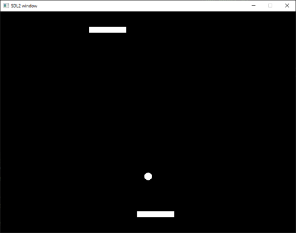

vflecs
======
Credit
------
- `flecs <https://github.com/SanderMertens/flecs>`_
- `Flecs Hub <https://github.com/flecs-hub>`_

Feature
-------
- CMake
- MSVC x64

Static Build
------------
.. code-block:: cmake

    ECS_PONG_STATIC

    FLECS_STATIC
    FLECS_MATH_STATIC

    FLECS_COMPONENTS_PHYSICS_STATIC
    FLECS_COMPONENTS_INPUT_STATIC
    FLECS_COMPONENTS_GRAPHICS_STATIC
    FLECS_COMPONENTS_GEOMETRY_STATIC
    FLECS_COMPONENTS_TRANSFORM_STATIC

    FLECS_SYSTEMS_SDL2_STATIC
    FLECS_SYSTEMS_TRANSFORM_STATIC
    FLECS_SYSTEMS_PHYSICS_STATIC

flecs_pong
----------
An implementation of pong in flecs, using . Tested on .

log
---
.. code-block:: c

    // Localize headers.
        #include "SDL.h" //#include <SDL2/SDL.h>
        //#include <bake_sdl2.h>

    // flecs-systems-physics\src\physics_2d.c(45,30): error C2065: 'MAXFLOAT': undeclared identifier
        #include <float.h> use C standard library FLT_MAX  

    // flecs-systems-sdl2\src\render.c(96,38): error C2057: expected constant expression
        EcsPoint2D* points = malloc(point_count * sizeof(points[0]));
        free(points)

        Sint16* gfx_x = malloc(point_count * sizeof(gfx_x[0]));
        Sint16* gfx_y = malloc(point_count * sizeof(gfx_y[0]));
        free(gfx_x)
        free(gfx_y)

    // Add C math lib header into pong example `main.c` for sin & cos
        #include <math.h>